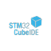
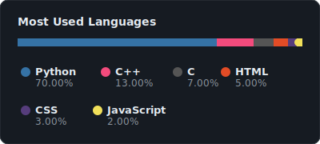

<h1 align="center">Mohamed Ibrahim J</h1>

  

  

---

## About Me

Engineering graduate focused on IT support, networking, and data analytics. Experienced in OCR systems, automation workflows, and data-driven applications. Strong foundation in troubleshooting, backend logic, and system-level problem solving. R&D Intern at Nokia from NOV 2025 - JAN 2026.

---

## Tech Stack

### Programming

  

### AI and Machine Learning

  
  
  
  
  
  

### Python Libraries

  
  
  

### Cloud

  

### Platforms, Tools, IDE and others

  
  
  
  
  
  
  
  
  
  

### Databases

  

### Operating Systems

  

### AI Tools for Automation

  
  
  

---

## GitHub Stats

  
  

---

## Top Languages

  

---

## Achievements

  
  Secured TOP 6 in SIH 2025 for KMRL Document Overloading Problem
  Completed R&D Intern on developing OCR system project for Nokia

---

## Contribution Snake

  

---

## Connect

  
  &nbsp;&nbsp;
  

